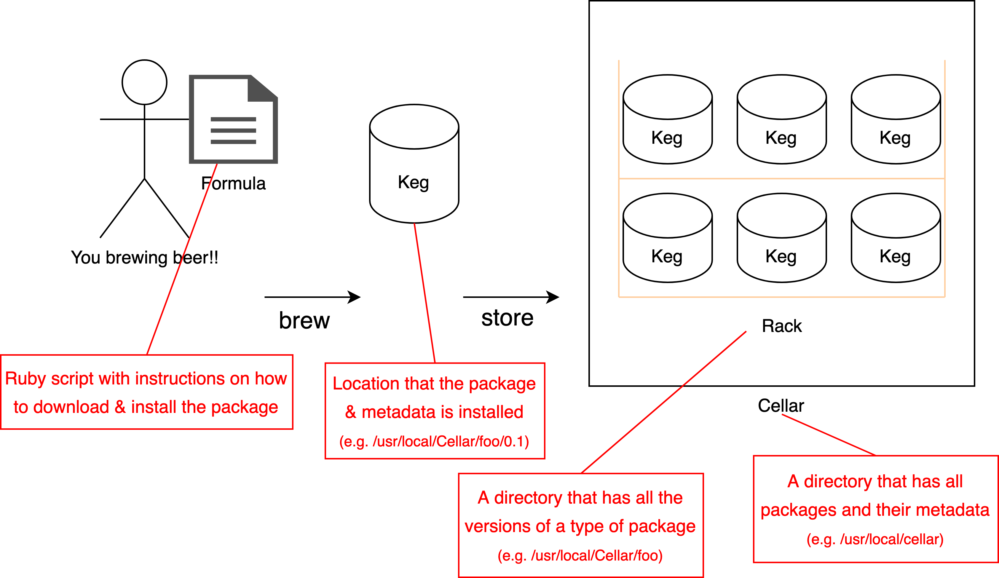

# Notes on Homebrew

## What is Homebrew?

A [package manager](https://en.wikipedia.org/wiki/Package_manager) for macOS. If you're familiar with linux, it's similar to using `apt` or `yum` to install packages. Essentially, it's an easy way to install tools and code libraries through the command line.

## Understanding the beer analogy

Ok, I've worked with a package manager before, but what are all these weird terms like "formula", "keg", "rack", "tap"? It'll make much more sense to you if you understand beer culture. Here's a *brief* and *oversimplified* introduction:


- When you brew your beer you'll start with a recipe (a.k.a. [**formula**](https://en.wikipedia.org/wiki/Beer#Ingredients)).
- Once you've brewed your beer (according to the formula) you can put it into a [**keg**](https://en.wikipedia.org/wiki/Keg).
- You can store all these kegs on a [**rack**](https://assets.katomcdn.com/q_auto,f_auto/products/098/098-31842TT7/098-31842tt7.jpg).
- You can keep those racks in a [**cellar**](https://hamillmachine.ca/wp-content/uploads/2017/07/modular-keg-racks.jpg).

## Tying it back to package managers



- All official Homebrew formulas are hosted in [this Github repository](https://github.com/Homebrew/homebrew-core)
- The default location a package is installed to is `/usr/local/Cellar`. The package executables are then sym-linked into `/usr/local/bin`
- Additional Homebrew concepts (e.g. Casks, Taps) found [here](https://docs.brew.sh/Formula-Cookbook).

## Example

Setup:

```bash
# Install Homebrew
$ /bin/bash -c "$(curl -fsSL https://raw.githubusercontent.com/Homebrew/install/HEAD/install.sh)"
==> This script will install:
/usr/local/bin/brew
/usr/local/share/doc/homebrew
/usr/local/share/man/man1/brew.1
/usr/local/share/zsh/site-functions/_brew
/usr/local/etc/bash_completion.d/brew
/usr/local/Homebrew
==> The following new directories will be created:
/usr/local/sbin
==> The Xcode Command Line Tools will be installed.

# Install a package
$ brew install jq

# Show jq executable sym-linked into Cellar
$ ls -l /usr/local/bin
lrwxr-xr-x  1 thomasnguyen  admin        23 Feb 12 21:32 jq -> ../Cellar/jq/1.6/bin/jq
```

A few interesting things to notice:

- everything is installed under `/usr/local`
- all executables installed by Homebrew are under `/usr/local/Cellar` and `/usr/local/Caskroom`
- these executables are sym-linked into `/usr/local/bin` so that they can be immediately called from your command line.

## Creating our own formula

## References

- <https://brew.sh/>
- <https://github.com/Homebrew>
- <https://docs.brew.sh/Formula-Cookbook>

<!-- 
TODO:
- create our own formula?
  - `brew create URL` && `brew install <formula>`
  - `brew edit`
  - openshift command line tool
  - openscap?
  - https://github.com/openshift/okd/releases
- Other ideas (1) tap, (2) cask / caskroom
-->
